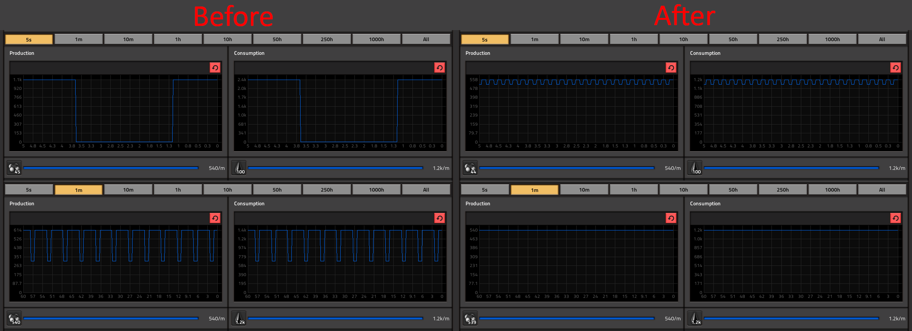

### Smooth Fluids

This is a Factorio mod that smoothes out fluid-using recipes, making them
proportionally take less time, use fewer resources, and create fewer products.

It was born from the frustration of seeing refineries taking a long time to
process large batches of resources, and create weird-ass production graphs that
were absolutely useless in the short timeframe.

The mod should work with any* recipes, vanilla or modded, as long as my mod's
script runs after they're ready.

If you have a mod that Smooth Fluids causes some issues with, please let me know
so I can try to solve it - most likely it will just require adding some
dependencies that you could try doing yourself too.

I think ideally Factorio should process tiny amounts of fluids with every update,
but that most likely would require reworking how the game crafts items, so until
then this mod is the next best thing.

A little warning: activating/deactivating this mod in an ongoing game will
probably cause a couple-seconds-long surge/lowering of altered fluids'
production. It doesn't matter in the long run though.

\* ATM I do not support recipes:
* with no fluid components.

And please note that I'm not a professional Lua dev etc.. Factorio modding is my
first time playing around with it, so if you have any suggestions for
changes/optimizations feel free to tell me, I'm open to improving :)
 